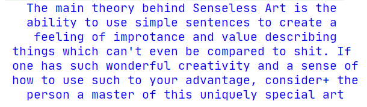

### Creating simple formatting codes - Detailed

> @Format(":b:")
* `b` -> bold

<br /><br />

> @Format(":$B$GBBG:")
* `$B` -> Blue Font Color
* `$GBBG` -> Green Bright Blue Background

<br /><br />

> @Format(":$YBG#00fb:", ":@ff9$B:")
* `$YBG` -> Yellow Background
* `#00f` ->  `#0000ff` font color.
* `b` -> Bold
* `@ff9` ->  `#ffff99` background color.
* `$B` -> Blue font color

<br /><br />

> @Format(":: :@d#0a0afabu: ::", "  :: > :@e#0a0%-30s:")
* `:: :` -> a single prepending `' '` with formatting before the input, here, `"Example"`.
* `@d` ->  `#dddddd` background color. 
* `#0a0afa` ->  `#0a0afa` font color.
* `b` -> Bold 
* `u` -> Underline 
* `: ::` -> a single appending `' '` with formatting after the input, here, `"Example"`.
* `  ::` -> double space, prepended without any formatting before the input, here, "String Formatting". 
* `:: > :` -> literal `' > '` prepended with formatting before the input, here, "String Formatting".
* `@e` ->   `#eeeeee` background color.
* `#0e0` ->  `#00ee00` font color.
* `%-30s` -> String Formatting, string adjusted to 30 characters with the input left aligned. 

<br /><br />


### Creating simple formatting codes - Summary

> @Format(":: :#F6BT:")
* `T` -> Prepend default time without formatting.
 
<br /><br />

> @Format(":<ss;SSS>:", " -:: :n:")
* `<ss;SSS>` -> Formatted Time,
    * ss -> 2 digits for seconds.
    * ; -> for a colon.
    * SSS -> 3 digits for milli seconds.
* `n` -> newLine in the end.

```js
log.prt("", "Yo!");
Thread.sleep(999);
log.prt("", "Yo!");
Thread.sleep(999);
log.prt("", "Yo!");
Thread.sleep(999);
log.prt("", "Yo!");
``` 
 
<br /><br />

> @Format({"::Par :$Y:", ":$B%10sn: points::"})
* `::Par :` -> Prepending, fromatted, "Par "
* `%10s` -> Formatting input to fit 10 characters, right aligned.
* `: points::` -> Appending, fromatted, " points"

<br /><br />

> @Format({<br />
>   "\n:: :@ff4$Bbu: ::",<br />
>   ":: :@ff9#FF1493b%-18s: ::",<br />
>   ":: :@ffd#82En%-27s: ::",<br />
>   "::    :w47w@e#4B0082%-47s: ::"<br />
> })
* `Format One`
    * `\n::` - prepended, formatless, newline
    * `:: :` - prepended, formatted, white space
    * `@ff4` -  `#ffff44` background color.
    * `$B` - Blue
    * `b` - Bold
    * `u` - Underline
    * `: ::`- appended, formatted, white space
* `Format Two`
    * `:: :` - prepended, formatted, white space
    * `@ff9` -  `#ffff99` background color.
    * `#ff1493` -  `#ff1493` font color.
    * `b` - Bold
    * `%-18s` - String formatted to fit 18 characters, left aligned  
    * `: ::`- appended, formatted, white space
* `Format Three`
    * `:: :` - prepended, formatted, white space
    * `@ffd` -  `#ffffdd` background color.
    * `#82e` -  `#8822ee` font color.
    * `n` - new line
    * `%-27s` - String formatted to fit 27 characters, left aligned  
    * `: ::`- appended, formatted, white space
* `Format Four`
    * `::    :` - prepended, formatted, white spaces
    * `w47w` - Word Warp. Divide the input such that their lengths wont exceed 47, and apply this same formatting to each. 
    * `@e` -  `#eeeeee` background color.
    * `#4B0082` -  `#4B0082` font color.
    * `%-47s` - String formatted to fit 47 characters, left aligned  
    * `: ::`- appended, formatted, white space
    * `::\n`- appended, formatless, newline
```js
FLog log = FLog.getNew();

log.prt("1", "Useless Sentences", "Some boring text ahead...",
        "So here we have some totally boring text just "+
        "lying around here for you to read. Though feel "+
        "totally comfortable if you wish to skip ahead."
);

log.prt("2", "Senseless Art", "Valuable Shit",
        "The main theory behind Senseless Art is the "+
        "ability to use simple sentences to create a "+
        "feeling of improtance and value describing "+
        "things which can't even be compared to shit. "+
        "If one has such wonderful creativity and a "+
        "sense of how to use such to your advantage, "+
        "consider+ the person a master of this uniquely "+
        "special art form."
);
``` 
<br /><br />

> @Format(":$B %*50s w49w:")
* `w49w` - *Higher priority*, word warp the text to fit a width of 49.
* `%*50s` - *Lower priority*, Center align text and to fit a width of 50.
```js
FLog log = FLog.getNew();
log.prt("The main theory behind Senseless Art is the " +
        "ability to use simple sentences to create a " +
        "feeling of improtance and value describing " +
        "things which can't even be compared to shit. " +
        "If one has such wonderful creativity and a " +
        "sense of how to use such to your advantage, " +
        "consider+ the person a master of this uniquely " +
        "special art form."
);
```
<br /><br />


