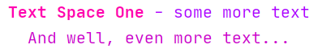

# MyLOGGER

A simple _logging_ tool to make **console outputs** look prettier...

For instructions on using the logger, writing a "Formatting Code"
and examples of `@Format` annotation,
[click this link](WRITING_A_FORMAT_FOR_DECORATION.md)

For instructions on using Tables and examples, 
[click this link](TABLES_EXAMPLES.md)

## Setup

#### Download

```groovy
allprojects {
    repositories {
        ...
        maven { url 'https://jitpack.io' }
    }
}

dependencies {
    ...
    implementation 'com.github.Minecraftian14:MyLOGGER:V2'
}
```

#### Initialise

```haskell
FLog logger = FLog.getNew();
```

#### Usage

```haskell
logger.prt(arg1, arg2, arg3 ... argn);
```

## Introduction

### Concept of Decoration

Apply the annotation @Format(String[] values) to a class
/constructor/method in order to assign a formatting rule 
called **Decoration**.

Later, when using the logger, it picks up the **Decoration** 
to apply simple formatting like making text Bold or coloured.

Note, that the number of formatting rules applied corresponds 
to the number of arguments given when using the logger. If 
number of Decorations is less than that of the given arguments 
the excess arguments will be printed without formats.

```haskell
@Format({":#FF1493b: ::", "::- :#82En:", "::  :$M:"})
public void testMethod() {
    FLog log = FLog.getNew();
    log.prt("Text Space One", "some more text", "And well, even more text...");
}
```
 


Content formatting rules are defined between a pair of ':'
characters. In the given example, there are three such rules
defined: `#FF1493b`, `#82En`, `$M`

Breaking down these rules we get:
* `#FF1493` - A 6 digit hex number to specify a font color. Note 
that for the console, only 255 different color are available in total. 
* `b` - To make text appear in the bold mode.
* `#82E` - A 3 digit hex number for font color.
* `n` - To add a new-line character in the end.
* `$M` - A way to choose from some basic pre-defined font colors.
M represents Magenta.

There are many more formatting options which can create
interesting effects like:

```haskell
@Format({"\n:: :@ff4$Bbu: ::", ":: :@ff9#FF1493b%-18s: ::", ":: :@ffd#82En%-27s: ::", "::    :~@e#4B0082%-47s: ::\n"})
public void test_NICEFormatting() {
    FLog log = FLog.getNew();

    log.prt("1", "Useless Sentences", "Some boring text ahead...",
            "So here we have some totally boring text just",
            "lying around here for you to read. Though feel",
            "totally comfortable if you wish to skip ahead."
    ); 
}
```


