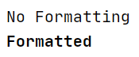
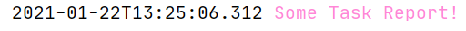
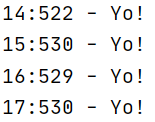
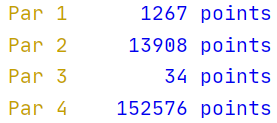

# Creating Decorations...

### The Boring Terminology
Let's first clear up what all these Terms are really about...
* **Decorate**

This is a Class Object which acts as a function on String
to give another String. Basically this is the place where
I define "how a given string is to be manipulated to get
the required formatting effect".

Note that this works only on one String input. As an
example, consider a simple for mat where we have to
prepend "Hello " before the given String. The respective
`Decorate` will be:

`Decorate dd = s -> "Hello " +s;`   

So, accordingly `dd.decorate("World!")` will return `Hello World!` 

* **Decoration**

This is a Class object which manages and creates a bunch
of `Decorate` objects.

The main idea behind having an array of `Decorate` objects is to
* be able to receive an array of `String` objects as input.
* and be able to provide each string a unique format matching element-wise.

If `Decorates` exceed the number of `Inputs`, excess are ignored.
If `Inputs` exceed the number of `decorates`, excess are left unaltered.

* **Format**

This is an annotation which can be applied to a Class/Type,
a Method or Constructor. This annotation is used to provide a
set of formatting codes so that they can be used by the `Logger`
to create a `Decoration` object to be used for formatting the 
input text.


### Creating a formatting code
#### List of all the formats available.
|Token             |Usage  |Console|Tag    |HTML   |
|------------------|-------|-------|-------|-------|
|pre-prefix        |here:: |Yes    |Yes    |Yes    |
|prefix            |::here:|Yes    |Yes    |Yes    |
|content           |:here: |Yes    |Yes    |Yes    |
|suffix            |:here::|Yes    |Yes    |Yes    |
|suf-suffix        |::here |Yes    |Yes    |Yes    |
|Color Tag         |$code  |Yes    |Yes    |Yes    |
|6 digit hex color |#RRGGBB|Yes    |Yes    |Yes    |
|3 digit hex color |#RGB   |Yes    |Yes    |Yes    |
|1 digit hex color |#G     |Yes    |Yes    |Yes    |
|6 digit hex bg    |@RRGGBB|Yes    |Yes    |Yes    |
|3 digit hex bg    |@RGB   |Yes    |Yes    |Yes    |
|1 digit hex bg    |@G     |Yes    |Yes    |Yes    |
|Bracket Formats   |[code] |No     |Yes    |No     |
|Time Format  |&lt;code&gt;|Yes    |Yes    |Yes    |
|Default Time      |T      |Yes    |Yes    |Yes    |
|Bold              |b      |Yes    |No     |Yes    |
|Underline         |u      |Yes    |Yes    |Yes    |
|Strikethrough     |-      |No     |Yes    |Yes    |
|Format Repeater   |~      |Yes    |Yes    |Yes    |
|String Formatter  |%-45s  |Yes    |Yes    |?      |
|New Line          |n      |Yes    |Yes    |?      |
|Tab Space         |t      |No     |No     |?      |

* Console -> a Formatting Style to decorate the console outputs.
* Tags -> a Formatting Style consisting of appending bracketed
tags to the input to inform a parser about the text format.
An example of this formatting is used in HyperLap2D to apply
simple formatting in it's Console.
* HTML -> currently it's not supported at all... As such it's 
in my To-Do list, but it's lack of use is kinda pushing it
behind of other features.


#### Structure of a formatting code
> PP::P:C:S::SS

> pre-prefix::prefix:content-format:suffix::suf-suffix

* Pre-Prefix - this is 'text' which is prepended to input. This
text is not formatted by the rules defined in 'content-format'.
* Prefix - this 'text' is prepended to input while also sharing
the same format as defined in 'content-format'.
* Content-Format - this contains the formatting styles.
* Suffix - this 'text' is appended to input while also sharing
the same format as defined in 'content-format'.
* Suf-Suffix - this is 'text' which is appended to input. This
text is not formatted by the rules defined in 'content-format'.


#### Creating simple formatting codes - Detailed

> @Format(":b:")
* `b` -> bold



> @Format(":$B$GBBG:")
* `$B` -> Blue Font Color
* `$GBBG` -> Green Bright Blue Background


> @Format(":$YBG#00fb:", ":@ff9$B:")
* `$YBG` -> Yellow Background
* `#00f` -> 3 digit hex font color, RGB|00f -> Blue
* `b` -> Bold
* `@ff9` -> 3 digit hex background, RGB|ff9 -> light yellow
* `$B` -> Blue font color


> @Format(":: :@d#0a0afabu: ::", "  :: > :@e#0a0%-30s:")
* `:: :` -> a single prepending `' '` with formatting before the input, here, `"Example"`.
* `@g` -> 1 digit hex color, light grey 
* `#0a0afa` -> 6 digit hex color, RRGGBB|0a0afa -> Blue
* `b` -> Bold 
* `u` -> Underline 
* `: ::` -> a single appending `' '` with formatting after the input, here, `"Example"`.
* `  ::` -> double space, prepended without any formatting before the input, here, "String Formatting". 
* `:: > :` -> literal `' > '` prepended with formatting before the input, here, "String Formatting".
* `@e` ->  1 digit hex color, a lighter grey
* `#0e0` -> 3 digit hex color, RGB|0e0 -> a green
* `%-30s` -> String Formatting, string adjusted to 30 characters with the input left aligned. 


#### Creating simple formatting codes - Summary

> @Format(":: :#F6BT:")
* `T` -> Prepend default time without formatting.
 


> @Format(":<ss;SSS>:", " -:: :n:")
* `<ss;SSS>` -> Formatted Time,
    * ss -> 2 digits for seconds.
    * ; -> for a colon.
    * SSS -> 3 digits for milli seconds.
* `n` -> newLine in the end.

```
log.prt("", "Yo!");
Thread.sleep(999);
log.prt("", "Yo!");
Thread.sleep(999);
log.prt("", "Yo!");
Thread.sleep(999);
log.prt("", "Yo!");
``` 
 


> @Format({"::Par :$Y:", ":$B%10sn: points::"})
* `::Par :` -> Prepending, fromatted, "Par "
* `%10s` -> Formatting input to fit 10 characters, right aligned.
* `: points::` -> Appending, fromatted, " points"
 


> @Format({<br />
>   "\n:: :@ff4$Bbu: ::",<br />
>   ":: :@ff9#FF1493b%-18s: ::",<br />
>   ":: :@ffd#82En%-27s: ::",<br />
>   "::    :~@e#4B0082%-47s: ::\n"<br />
> })
* `Format One`
    * `\n::` - prepended, formatless, newline
    * `:: :` - prepended, formatted, white space
    * `@ff4` -  `#ffff44` background color.
    * `$B` - Blue
    * `b` - Bold
    * `u` - Underline
    * `: ::`- appended, formatted, white space
* `Format Two`
    * `:: :` - prepended, formatted, white space
    * `@ff9` -  `#ffff99` background color.
    * `#ff1493` -  `#ff1493` font color.
    * `b` - Bold
    * `%-18s` - String formatted to fit 18 characters, left aligned  
    * `: ::`- appended, formatted, white space
* `Format Three`
    * `:: :` - prepended, formatted, white space
    * `@ffd` -  `#ffffdd` background color.
    * `#82e` -  `#8822ee` font color.
    * `n` - new line
    * `%-27s` - String formatted to fit 27 characters, left aligned  
    * `: ::`- appended, formatted, white space
* `Format Four`
    * `::    :` - prepended, formatted, white spaces
    * `~` - format repeater, all inputs with an unmatched Decorate, will have this format.
    * `@e` -  `#eeeeee` background color.
    * `#4B0082` -  `#4B0082` font color.
    * `%-47s` - String formatted to fit 47 characters, left aligned  
    * `: ::`- appended, formatted, white space
    * `::\n`- appended, formatless, newline
```
FLog log = FLog.getNew();

log.prt("1", "Useless Sentences", "Some boring text ahead...",
        "So here we have some totally boring text just",
        "lying around here for you to read. Though feel",
        "totally comfortable if you wish to skip ahead."
);

log.prt("2", "Senseless Art", "Valuable Shit",
        "The main theory behind Senseless Art is the",
        "ability to use simple sentences to create a",
        "feeling of improtance and value describing",
        "things which can't even be compared to shit.",
        "If one has such wonderful creativity and a",
        "sense of how to use such to your advantage,",
        "consider, the person a master of this uniquely",
        "special art form."
);
``` 


